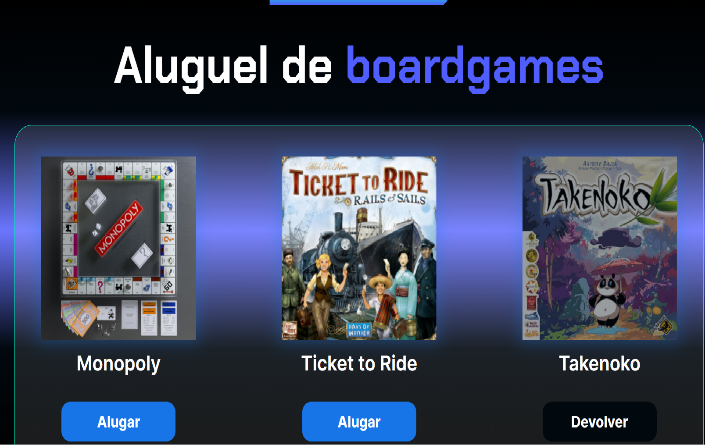

# Alugames

O Alugames é uma landing page que simula a locação de games.

## 🔨 Funcionalidades do projeto

O projeto tem como objetivo simular uma locadora de games online. Exibindo se o game está disponível ou não para a locação.

## ✔️ Técnicas e tecnologias utilizadas

-`HTML`
-`CSS`
-`Javascript`

## 🛠️ Abrir e rodar o projeto

Para abrir e rodar o projeto, utilize um editor de código de sua escolha.
Depois, abra o projeto no seu navegador.

## 📚 Mais informações

O Alugames é uma empresa fictícia utilizada para aperfeiçoar as habilidades.
A ideia principal desse projeto é evoluir ainda mais os conhecimentos em HTML e CSS e principalmente focado em Javascript.

## VERCEL

https://alu-games-virid.vercel.app/#
